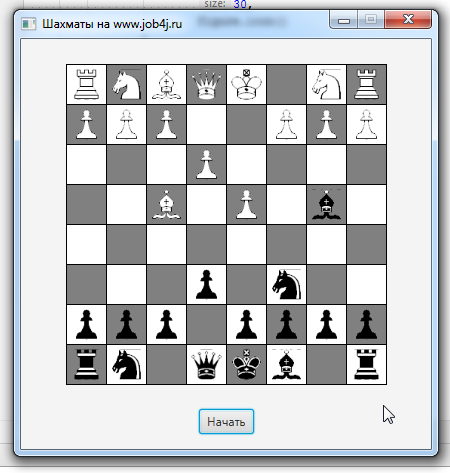

# XADREZ COM JAVAFX
👨‍🏫O PROJETO É UMA APLICAÇÃO DE TABULEIRO DE XADREZ DESENVOLVIDA EM JAVA, UTILIZANDO A BÍBLIOTECA JAVAFX PARA A INTERFACE GRÁFICA.

 <br>

## DESCRIÇÃO: 
O projeto é uma aplicação de tabuleiro de xadrez desenvolvida em **Java**, utilizando a **Bíblioteca JavaFX** para a interface gráfica. Ele simula um jogo de xadrez no qual os usuários podem mover peças em um tabuleiro digital.

A aplicação inclui todas as peças tradicionais do xadrez (peões, torres, cavalos, bispos, rainha e rei), posicionadas no tabuleiro inicial, como no xadrez convencional. As peças são representadas graficamente, e o jogador pode clicar e arrastar para realizar movimentos.

O jogo possui uma lógica básica que controla as peças no tabuleiro, verifica suas posições e determina se um movimento é permitido, respeitando regras como:
- O movimento das peças (diagonal, linha reta, ou "em L").
- Se a peça está obstruída por outra.
- Se o movimento solicitado é válido.

## EXECUTANDO O PROJETO:
1. **Certifique-se de que o projeto esteja compilado:**
   Antes de executar o projeto, você deve garantir que ele foi compilado corretamente. Navegue até o diretório `./CODIGO`, e use o seguinte comando para compilar:

   ```bash
   mvn clean install
   ```

2. **Executar o projeto:**
   Para executar a aplicação com o Maven, usando a classe principal definida no seu `pom.xml`, use o comando:

   ```bash
   mvn javafx:run
   ```

## COMO JOGAR?  
1. **Iniciar o jogo**:
   - Ao iniciar o programa, o tabuleiro de xadrez será exibido, com as peças pretas e brancas dispostas em suas posições iniciais.

2. **Movimento das peças**:
   - Para mover uma peça:
     - Clique e arraste a peça para o destino desejado no tabuleiro.
     - Solte o botão do mouse para confirmar o movimento.
   - Se o movimento for inválido, uma mensagem de erro será exibida, e a peça retornará à sua posição original.

3. **Regras de movimento**:
   - Cada tipo de peça segue suas regras tradicionais:
     - **Rei**: Move-se uma casa em qualquer direção.
     - **Rainha**: Move-se em linha reta ou diagonal, por quantas casas desejar.
     - **Bispo**: Move-se em diagonais por quantas casas quiser.
     - **Cavalo**: Move-se em forma de "L".
     - **Torre**: Move-se em linha reta (horizontal ou vertical).
     - **Peão**: Move-se uma casa para frente (ou duas casas, se for o primeiro movimento).
   - Capturas, xeque, xeque-mate e promoções de peões ainda não estão implementados na lógica.

4. **Reiniciar o jogo**:
   - Um botão chamado **"Iniciar"** permite reiniciar o jogo. Clicar nele restaurará as peças às suas posições iniciais.

## TECNOLOGIAS USADAS:
- [LINGUAGEM JAVA:](https://github.com/VILHALVA/CURSO-DE-JAVA) A linguagem de programação Java é amplamente utilizada para o desenvolvimento de aplicativos devido à sua portabilidade, segurança e robustez. Ela é uma escolha popular para desenvolver aplicativos desktop, web e móveis.

- [JAVAFX:](https://github.com/VILHALVA/CURSO-DE-JAVAFX) JavaFX é uma Bíblioteca (plataforma) de desenvolvimento rica para criar aplicações gráficas (GUI) modernas e sofisticadas em Java. Ele é projetado para substituir o Swing como a principal biblioteca para GUIs no Java. JavaFX oferece uma ampla gama de recursos que tornam o desenvolvimento mais intuitivo, flexível e visualmente atraente.

## CREDITOS:
- [PROJETO CRIADO PELO "peterarsentev"](https://github.com/peterarsentev/games_oop_javafx)
- [PROJETO EDITADO PELO VILHALVA](https://github.com/VILHALVA)


